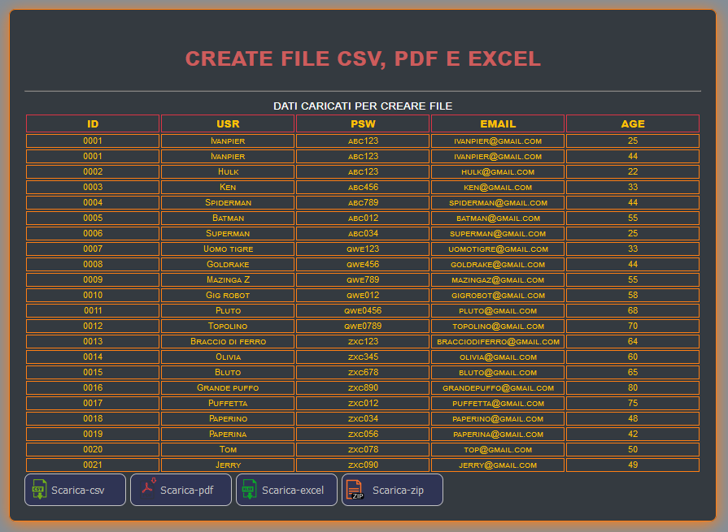

## INIZIO ##

-> In questa Repositories vado a creare le funzioni su come creare e salvare file. 
<ul>
  <li>csv</li>
  <li>pdf</li>
  <li>excel</li>
  <li>zip Nota: (per questa funzione è necessario scarica l'app e provarla in locale. Motivo file PhP).</li>
</ul>
-> Dati recuperati in modo statico che si può rendere dinamico esempio dal db phpMyAdmin.

<a href="https://ivanpierdeveloper.github.io/create-file/" target="_blank">Go To</a>

## FINE ##

