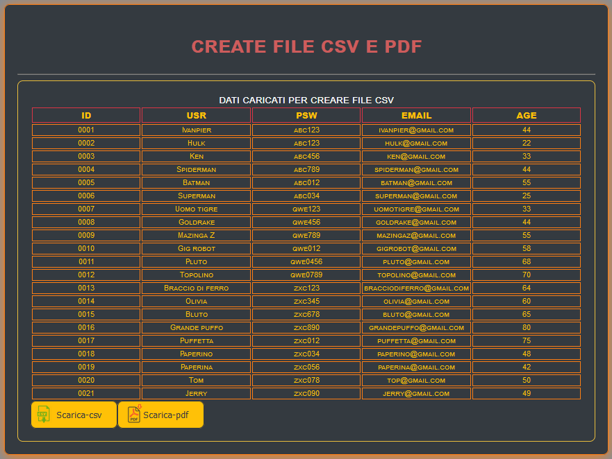

## INIZIO ##

-> In questa Repositories vado a creare la funzione su come creare e salvare file csv. 
-> Dati recuperati dal db oppure in modo statico che si può rendere dinamico.

<a href="https://ivanpierdeveloper.github.io/create-file/" target="_blank">Go To</a>

## FINE ##

